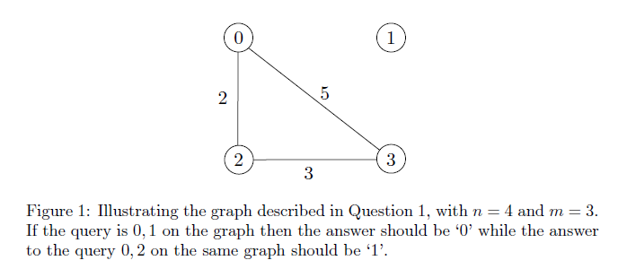
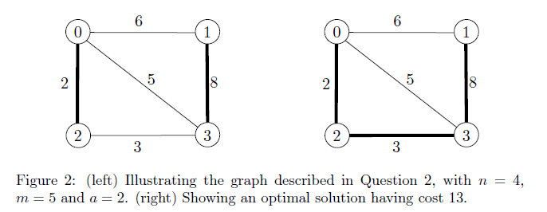
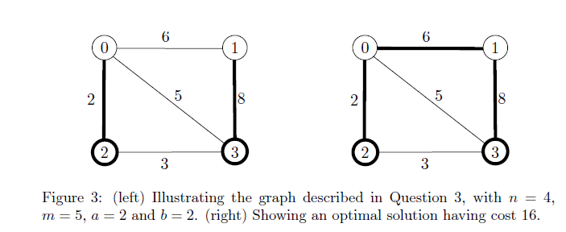

# graph-traversal

## graph-traversal-1
The algorithm is meant to decide for a given (not necessarily connected) undirected graph, given points U and V, if a path exists between U and V. A DFS is used for the implementation of this solution.

Input is in the following form:  
>n  
m  
vertexId vertexId weight  
vertexId vertexId weight  
...  
vertexId vertexId weight  
q  
vertexId vertexId  
vertexId vertexId  
...

Input explanation:  
First define the graph by defining "n" vertices and "m" edges.  
Then provide a list of edges (defined by the vertices on each side) in the graph, with their associated weight.  
Then provide a list of size "q". This is a list of "queries" (pairs of vertices) to apply the algorithm to.

Output:  
For each pair of vertices to test in order, output 0 (no path exists) or 1 (a path exists).
 
 
An example of valid input is provided in "graph-traversal-1/graphSimple.in". An example output for this is provided below.  

 
 

## graph-traversal-2
This is a variant of the Minimum Spanning Tree (MST) problem with an additional requirement: specified edges that must be included in the final tree. Prim's algorithm is used for the implementation of this solution.

Input is in the following form:  
>n  
m  
vertexId vertexId weight  
vertexId vertexId weight  
...  
vertexId vertexId weight  
a  
vertexId vertexId  
vertexId vertexId  
...

Input explanation:  
First define the graph by defining "n" vertices and "m" edges.  
Then provide a list of edges (defined by the vertices on each side) in the graph, with their associated weight.  
Then provide a list of size "a". This is a list of edges (pairs of vertices) that must be included in the final MST.

Output:  
The total weight of the resulting MST, rounded to 2 decimal places.
 
 
An example of valid input is provided in "graph-traversal-2/graphExample.in". An example output for this is provided below.  

 
 

## graph-traversal-3
This is another variant of the MST problem, an extension of (graph-traversal-2), where there is an additional requirement: a specified set of vertices which must be connected to exactly 1 edge. This solution again uses Prim's algorithm.

Input is in the following form:  
>n  
m  
vertexId vertexId weight  
vertexId vertexId weight  
...  
vertexId vertexId weight  
a  
vertexId vertexId  
vertexId vertexId  
...  
b  
vertexId  
vertexId  
...

Input explanation:  
First define the graph by defining "n" vertices and "m" edges.  
Then provide a list of edges (defined by the vertices on each side) in the graph, with their associated weight.  
Then provide a list of size "a". This is a list of edges (pairs of vertices) that must be included in the final MST.  
Then provide another list of size "b". This is a list of vertices that must be part of exactly 1 edge in the final MST.

Output:  
The total weight of the resulting MST, rounded to 2 decimal places.
 
 
An example of valid input is provided in "graph-traversal-3/graphExample.in". An example output for this is provided below.  

